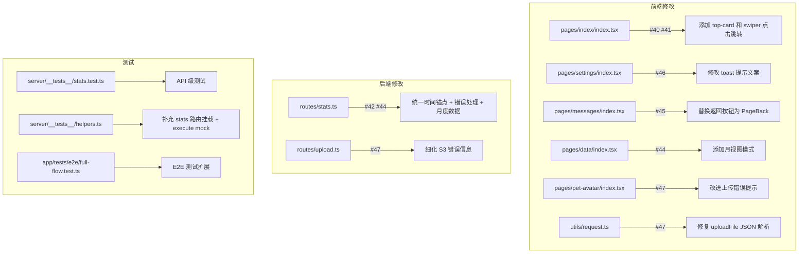

# 技术设计文档

## 架构概览

本次修复涉及前端 6 个文件和后端 2 个路由的改动，以及新增/扩展端到端测试。修改范围集中、风险可控。



## 逐 Issue 技术方案

### #40 + #41：主页导航跳转

**文件**：`packages/app/src/pages/index/index.tsx`

**修改内容**：
1. 给 `top-card` 添加 `onClick` 处理：
   - 有宠物且 `currentPet` 非 null → `Taro.navigateTo({ url: '/pages/pet-info/index?petId=${currentPet.id}' })`
   - 有宠物但 `currentPet === null`（过渡窗口）→ 不跳转（空值保护）
   - 无宠物 → `Taro.navigateTo({ url: '/pages/pet-info/index' })`
2. 给 Swiper 中的 `pet-slide` 添加 `onClick`：
   - `pet` 非 null → `Taro.navigateTo({ url: '/pages/pet-avatar/index?petId=${pet.id}' })`
   - `pet === null` → 不跳转

**空值保护**：`hasPet === true` 但 `currentPet === null` 存在于 `pets` 更新后、effect 归零 `currentPetIndex` 之前的短暂窗口。所有跳转必须检查 `currentPet`/`pet` 非 null。

### #42：数据中心 500 错误

**后端文件**：`packages/server/src/routes/stats.ts`
**前端文件**：`packages/app/src/pages/data/index.tsx`

**根因**：
1. stats 路由缺少 try-catch，SQL 查询失败直接 500
2. 多条 SQL 各自调用 `NOW()` 可能跨午夜不一致

**后端修改**：
1. 在路由开头计算一次 `today`，所有查询使用该锚点替代 `NOW()`
2. 整个路由包裹 try-catch，catch 返回 `500 { error: "统计数据加载失败" }`
3. 验证 `petId` 非空

**前端修改**：
1. 当 `routePetId` 的 stats 请求返回 404 时，回退到用第一个宠物重试或显示"暂无宠物数据"
2. 错误态统一用 `errorMessage` 展示，不再是白屏 500

### #44：月视图支持

**后端文件**：`packages/server/src/routes/stats.ts`
**前端文件**：`packages/app/src/pages/data/index.tsx`

**后端修改**：
1. 新增 `getLastNDateBuckets(today, n)` 通用函数（替代 `getLastSevenDateBuckets`）
2. 新增 `monthBars` 查询：`BETWEEN today - 29 AND today`（共 30 天），用 bucket 补零
3. 新增 `monthPieItems`：30 天内活动类型分布
4. 所有查询共享同一个 `today` 锚点

**前端修改**：
1. `Mode` 类型扩展为 `"week" | "day" | "month"`
2. 移除 `item.key !== "month"` 守卫
3. `StatsResponse` 中 `monthBars` 和 `monthPieItems` 为可选字段（`?:`），防止前端先于后端发版崩溃
4. 月视图使用**水平滚动容器**（`ScrollView scrollX`），每个柱子固定宽度，而非复用周视图的 `13%` 百分比布局
5. 横轴标签使用日期数字（如 1, 5, 10, 15, 20, 25, 30），稀疏标注避免重叠
6. 月视图无数据时回退显示"暂无月度统计数据"

### #45：消息中心返回按钮

**文件**：`packages/app/src/pages/messages/index.tsx`

**修改内容**：
1. 导入 `PageBack` 组件
2. 删除 `messages-header` 中的 `header-back` 文字按钮
3. 在页面顶部添加 `<PageBack />`
4. header 布局调整：只保留标题和"全部已读"按钮

### #46：设置页 toast 文案

**文件**：`packages/app/src/pages/settings/index.tsx`

**修改内容**：
```typescript
const showComingSoon = () => {
  Taro.showToast({ title: "即将上线，敬请期待", icon: "none" });
};
```

### #47：上传错误处理优化

**前端文件**：`packages/app/src/utils/request.ts`、`packages/app/src/pages/pet-avatar/index.tsx`
**后端文件**：`packages/server/src/routes/upload.ts`

**前端 `uploadFile` 工具修复**（关键修复）：
`JSON.parse(res.data ?? "{}")` 在 MinIO/Caddy 返回 HTML 或空 body 时会抛 `SyntaxError`，导致无法获取后端错误文案。修改为安全解析：

```typescript
let parsedData: any = {};
try {
  parsedData = JSON.parse(res.data ?? "{}");
} catch {
  // 非 JSON 响应（如 Caddy 502 HTML 页面），使用状态码作为错误信息
}
```

**前端页面改进**：
1. `handleUpload` 中对文件大小预校验（选择图片后立即检查 > 10MB）
2. 分别捕获 uploadFile 和 avatars 请求的错误，给出不同提示

**后端改进**：
1. 区分 `ensureBucket` 失败 → "存储服务不可用，请稍后重试"
2. 区分 `PutObjectCommand` 失败 → "文件上传失败，请稍后重试"

## 测试策略

### 后端测试基建补充

**修改文件**：`packages/server/src/__tests__/helpers.ts`
- 添加 `import statsRoute` 并在 `createApp()` 中挂载 `/api/stats`

**修改文件**：`packages/server/src/__tests__/mock-db.ts`
- 添加 `execute()` 方法支持，返回 `_results.execute` 数组（用于 raw SQL 查询）

### 后端 API 测试

**新增文件**：`packages/server/src/__tests__/stats.test.ts`

测试用例：
1. 正常请求返回完整 stats 数据（weekBars 7 天 / dayBars 24 小时 / monthBars 30 天）
2. 无权限访问返回 404
3. 无行为数据返回全零 buckets
4. petId 无效返回 404

### 前端 E2E 测试扩展

**修改文件**：`packages/app/tests/e2e/full-flow.test.ts`

新增测试用例：
1. **主页导航测试**：点击 `.top-card` → 验证跳转到 `pages/pet-info/index`，URL 含 `petId`；返回后点击宠物图片 → 验证跳转到 `pages/pet-avatar/index`
2. **设置页交互**：点击非退出的设置项 → 通过 `page.callMethod('onShow')` + 检查页面文本/toast mock 验证
3. **消息中心返回**：验证 `.page-back` 选择器存在（PageBack 组件）且可点击返回
4. **数据中心月视图**：点击第三个 `.mode-tab` → 验证 mode 切换（通过页面数据 `getData` 检查 mode 为 "month"）

**E2E 测试辅助扩展**（`helpers.ts`）：
- 新增 `mockWxMethod('showToast', ...)` 用于 toast 断言
- 新增 `getPageData(page)` 获取页面 data 状态

## 需要修改的文件清单

| 文件 | 修改类型 | 对应 Issue |
|------|----------|-----------|
| `packages/app/src/pages/index/index.tsx` | 修改 | #40, #41 |
| `packages/app/src/pages/settings/index.tsx` | 修改 | #46 |
| `packages/app/src/pages/messages/index.tsx` | 修改 | #45 |
| `packages/app/src/pages/data/index.tsx` | 修改 | #42, #44 |
| `packages/app/src/pages/pet-avatar/index.tsx` | 修改 | #47 |
| `packages/app/src/utils/request.ts` | 修改 | #47 |
| `packages/server/src/routes/stats.ts` | 修改 | #42, #44 |
| `packages/server/src/routes/upload.ts` | 修改 | #47 |
| `packages/server/src/__tests__/helpers.ts` | 修改 | 测试基建 |
| `packages/server/src/__tests__/mock-db.ts` | 修改 | 测试基建 |
| `packages/server/src/__tests__/stats.test.ts` | 新增 | #42, #44 |
| `packages/app/tests/e2e/full-flow.test.ts` | 修改 | 全部 |
| `packages/app/tests/e2e/helpers.ts` | 修改 | 测试基建 |

## 安全考虑

- stats 路由已有 `canAccessPet` 权限检查，保持不变
- upload 路由已有文件类型和大小校验，保持不变
- 新增的前端跳转使用 `petId` 参数，该参数来自已鉴权的 API 响应
- `uploadFile` 的 JSON 安全解析防止 Caddy/MinIO 非 JSON 响应导致的异常泄露
