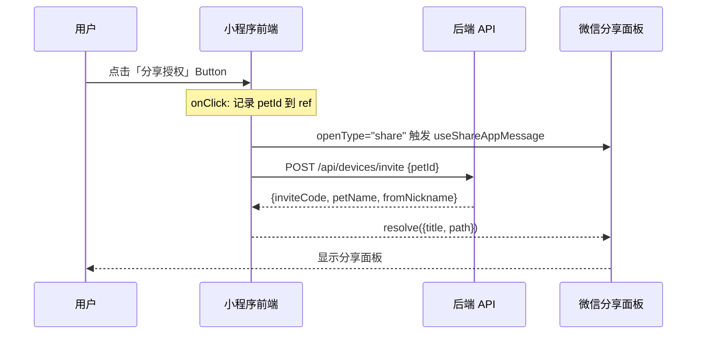

# 技术设计

## 架构概览

纯前端改动，不涉及后端修改。核心是将现有的 Toast 占位按钮替换为微信原生分享能力：



## 涉及修改的文件

| 文件 | 改动 |
|------|------|
| `packages/app/src/pages/devices/index.tsx` | 引入 `Button`、`useShareAppMessage`；添加 `sharePetIdRef`；替换分享按钮为 `<Button openType="share">`；拆分 `handleAction` |
| `packages/app/src/pages/devices/index.scss` | 为 `.action-btn` 和 `.desktop-action-chip` 添加按钮重置样式 |
| `packages/app/src/pages/devices/index.config.ts` | **新增**，配置 `enableShareAppMessage: true` |
| `packages/app/src/pages/invite/index.tsx` | 引入 `Button`、`useShareAppMessage`；替换「一键连接」按钮（仅 `mode !== "pair"` 时）；移除 `handleGenerateInvite` |
| `packages/app/src/pages/invite/index.scss` | 为 `.connect-button` 添加按钮重置样式 |
| `packages/app/src/pages/invite/index.config.ts` | **新增**，配置 `enableShareAppMessage: true` |

## 实现细节

### 1. 页面级分享配置（关键前置条件）

Taro 的 `useShareAppMessage` 需要页面开启分享配置才能生效。为 devices 和 invite 页面各创建 `index.config.ts`：

```typescript
export default definePageConfig({
  enableShareAppMessage: true,
});
```

### 2. devices 页面

**核心机制：**
- 使用 `useRef` 存储当前要分享的 petId（`sharePetIdRef`），因为 `useShareAppMessage` 回调需要同步读取最新值
- `useShareAppMessage` 回调返回 Promise，在 Promise 中调用 `POST /api/devices/invite` 生成邀请码
- 分享按钮从 `<View>` 改为 `<Button openType="share">`，通过 `onClick` 在触发分享前设置 `sharePetIdRef.current`

**右上角菜单分享处理：**
- `useShareAppMessage` 回调的 `res.from` 区分 `"button"` 和 `"menu"` 两种来源
- 当 `res.from === "menu"` 时，使用 `selectedPet.id`（当前选中的宠物 tab）作为 petId，而非 `sharePetIdRef`
- 当 `res.from === "button"` 时，使用 `sharePetIdRef.current`（按钮点击时设置的 petId）

**按钮替换策略：**
- 项圈卡片「分享授权」：`<View className="action-btn">` → `<Button openType="share" className="action-btn">`
- 桌面端卡片「分享」（action === "share"）：`<View className="desktop-action-chip">` → `<Button openType="share" className="desktop-action-chip">`
- 非分享按钮（delete、unbind）：保持 `<View>` 不变

**handleAction 类型调整：**
- 分享功能由 `<Button openType="share">` + `useShareAppMessage` 处理，不再通过 `handleAction`
- `handleAction` 签名中移除 "share" 类型，但由于 TypeScript 在三元表达式的 else 分支不会自动 narrow `desktop.action` 的类型，需要用类型断言 `desktop.action as "delete" | "unbind"`

### 3. invite 页面

**核心机制：**
- `useShareAppMessage` 回调中检查 `pet` 是否已加载（非 null），未加载则返回空对象（使用小程序默认分享内容）
- `code` 模式（接受邀请）下不需要分享按钮，`useShareAppMessage` 回调返回空对象

**mode 区分处理：**
- `mode === "pair"`：保持现有行为不变（仍显示 `<View>` 按钮 + Toast），不替换为分享按钮。配对语义与授权分享不同
- `mode === "invite"`（默认）：「一键连接」按钮从 `<View>` 改为 `<Button openType="share">`

### 4. CSS 按钮重置

微信小程序 `<Button>` 有大量默认样式，需要完整覆盖以匹配原有 `<View>` 外观：

```scss
// 需要添加到使用 Button 的 class 中
margin: 0;           // 覆盖 auto margin
padding: 0 Xrpx;    // 保持原有 padding
border: none;        // 移除默认 border
line-height: normal; // 覆盖默认 line-height: 2.55
font-size: inherit;  // 覆盖默认 18px
color: inherit;      // 继承父元素颜色
// 关键：覆盖 Button 默认的 display: block
// 现有 class 已有 display: flex，会覆盖
&::after {
  display: none;     // 移除 ::after 伪元素边框
}
```

### 5. 分享卡片内容

```typescript
{
  title: `${fromNickname}邀请你一起看${petName}`,
  path: `/pages/invite/index?code=${inviteCode}`,
  // imageUrl 不传，使用小程序默认截图
}
```

### 6. 错误处理

- API 调用失败：`Taro.showToast({ title: "生成邀请链接失败", icon: "none" })`，同时 resolve 空对象。
  > 注意：微信 `openType="share"` 一旦触发，分享面板无法取消。API 失败后 resolve 空对象会让分享面板使用默认内容（页面标题 + 当前页面路径）。这是微信原生机制的限制，不影响功能正确性——用户看到错误提示后可以手动取消分享。
- 宠物数据未加载：分享回调返回空对象，使用小程序默认分享
- 重复点击：邀请码由后端 HMAC 签名生成，每次生成独立码，后端有 `onConflictDoNothing` 处理，重复点击不会产生副作用

### 7. 已知的语义错位（产品层面，本次不改）

桌面端卡片上的「分享」按钮交互语义是"分享该桌面端"，但后端 `POST /api/devices/invite` 的能力是"授权该宠物的全部桌面端权限"。这是产品设计与后端能力的已有错位，本次不改变，后续可作为产品优化项。

## 测试策略

- 在微信开发者工具中测试分享按钮是否正确触发分享面板
- 验证分享卡片的 title 和 path 正确
- 验证右上角菜单分享使用当前选中宠物
- 验证接收方点击分享卡片能正确跳转到 invite 页面并展示邀请信息
- 验证 `mode=pair` 的按钮行为不受影响
- 验证非分享按钮（删除、解绑）行为不受影响
- 验证 API 调用失败时的错误提示
- 验证接收方遇到异常（自己的邀请、已失效、重复接受）时 invite 页面的错误展示

## 安全考虑

- 邀请码由后端 HMAC 签名生成，前端不参与密钥管理
- 邀请码有 7 天有效期，由后端校验
- 单次使用限制由后端事务保证
