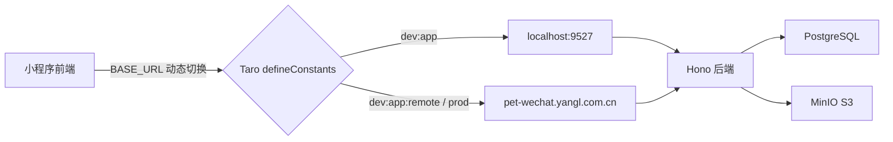

# 技术设计：全流程前后端接通

## 架构概览



本次改动分 4 层：基础设施 → 后端新接口 → 前端删 mock → 前端接真实 API。

---

## 一、环境切换机制

### 方案：Taro `defineConstants` + npm scripts

**修改文件：**
- `packages/app/config/index.ts` — 根据环境变量注入 `API_BASE_URL` 和 `ENABLE_DEV_LOGIN`
- `packages/app/src/utils/request.ts` — 使用 `API_BASE_URL` 替代硬编码
- `packages/app/src/utils/ws.ts` — 同理
- `package.json`（根目录）— 新增 `dev:app:remote` script

**实现：**

`config/index.ts` 的 `defineConstants` 中：
```typescript
defineConstants: {
  API_BASE_URL: JSON.stringify(
    process.env.API_BASE_URL || (
      process.env.NODE_ENV === 'production'
        ? 'https://pet-wechat.yangl.com.cn'
        : 'http://localhost:9527'
    )
  ),
  ENABLE_DEV_LOGIN: JSON.stringify(
    process.env.NODE_ENV !== 'production'
  ),
},
```

根 `package.json` 新增：
```json
"dev:app:remote": "API_BASE_URL=https://pet-wechat.yangl.com.cn pnpm --filter app dev:weapp"
```

`request.ts`：
```typescript
declare const API_BASE_URL: string;
export const BASE_URL = API_BASE_URL;
```

**前置条件（注释到 CLAUDE.md 或 README）：**
- 微信开发者工具中需**关闭「不校验合法域名」**才能使用 `http://localhost`
- `localhost` 仅限开发者工具本机调试，真机预览/远程联调需使用 `dev:app:remote`

---

## 二、后端新增接口

### 2.1 开发调试登录 `POST /api/auth/dev-login`

**文件：** `packages/server/src/routes/auth.ts`

使用显式环境变量 `ENABLE_DEV_LOGIN` 控制，而非 `NODE_ENV` 负向判断：

```typescript
if (process.env.ENABLE_DEV_LOGIN === 'true') {
  authRoute.post('/dev-login', async (c) => {
    const { phone } = await c.req.json<{ phone: string }>();
    // upsert 用户（按 phone 查找或创建）
    // 返回 { token, user }
  });
}
```

**安全设计：**
- 后端通过 `ENABLE_DEV_LOGIN=true` 显式开启（docker-compose.yml 开发环境设置，prod 不设置）
- 前端通过编译时 `ENABLE_DEV_LOGIN` 常量控制 UI 是否渲染开发登录入口
- 两个开关独立但语义一致，避免 host heuristic 和负向判断的脆弱性

### 2.2 设备扫码注册 `POST /api/devices/collars/register`

**文件：** `packages/server/src/routes/devices.ts`

逻辑：
1. 接收 `{ macAddress, name? }`
2. **MAC 归一化**：转大写、去除 `:` `-` 空格等分隔符，统一为纯大写十六进制
3. 查找是否已存在该归一化 MAC 的项圈
4. 不存在 → `INSERT` 创建 + 设置 userId 为当前用户
5. 存在且 userId 为 null → `UPDATE` claim 给当前用户
6. 存在且 userId === 当前用户 → 返回已有设备（幂等）
7. 存在且属于其他用户 → 返回 409 错误
8. 返回 `{ collar }`

桌面端同理：`POST /api/devices/desktops/register`

**MAC 归一化函数：**
```typescript
function normalizeMac(mac: string): string {
  return mac.replace(/[:\-\s]/g, '').toUpperCase();
}
```

### 2.3 行为统计聚合 `GET /api/stats/:petId`

**文件：** 新建 `packages/server/src/routes/stats.ts`

**数据模型现状：** `pet_behaviors` 只有 `actionType + timestamp`，没有持续时长字段。因此统计以**事件计数**为核心指标，而非"活跃分钟数"。

返回结构：
```typescript
{
  // 近 7 天每天的行为事件数（固定 7 个 bucket，无数据补零）
  weekBars: Array<{ day: string; count: number }>,  // day: "2026-03-28"
  // 当天 24 小时行为分布（固定 24 个 bucket，无数据补零）
  dayBars: Array<{ hour: number; count: number }>,   // hour: 0-23
  // 行为类型占比（近 7 天，分母为 0 时返回空数组）
  pieItems: Array<{ type: string; count: number; percentage: number }>,
  // 日统计摘要
  daySummary: {
    date: string;             // "2026-03-28"
    totalCount: number;       // 当天总事件数
    dominantAction: string | null;  // 最多的行为类型，无数据时 null
    actionCounts: Record<string, number>;
  }
}
```

**时区处理：** 前端在请求中传递 `?tz=Asia/Shanghai`，后端使用 `AT TIME ZONE` 转换后聚合，确保日历日边界正确。

**补零策略：** 后端负责补零——生成完整的 7 天 / 24 小时 bucket，SQL 查询结果为稀疏数据，在应用层填充缺失的 bucket 为 0。

---

## 三、前端删除 Mock 系统

### 删除文件
- `packages/app/src/mock/data.ts`
- `packages/app/src/mock/handler.ts`
- `packages/app/src/mock/mode.ts`
- `packages/app/src/components/MockToggle/index.tsx`
- `packages/app/src/components/MockToggle/index.scss`（如存在）

### 清理引用
- `app.ts`：删除 `ensureMockLoginState()` 调用和 import；**新增** `connectWs()` 调用（登录态存在时）
- `utils/request.ts`：删除 `isMockMode`、`handleMockRequest` 相关分支
- `utils/ws.ts`：删除 `isMockMode` 检查
- `pages/login/index.tsx`：删除 `handleMockLogin`

---

## 四、WebSocket 连接生命周期

**问题：** 当前 `connectWs()` 只有工具函数，没有任何调用点。

**方案：**
- `app.ts` 的 `useLaunch` 中：检查 token 存在 → `connectWs()`
- `login` 页登录成功后：`connectWs()`
- 登出时：`disconnectWs()` + `clearToken()`
- `connectWs()` 内部已有断线重连逻辑，不需要额外处理

**WS 消息类型扩展：** 本次不新增 `message:new` 等事件类型。消息页仅使用 HTTP 轮询，WebSocket 只用于已有的 `behavior:new` 和 `avatar:done`。后续迭代再补消息实时推送。

---

## 五、逐页改造方案

### 5.1 登录页 (`pages/login`)

- 删除 mock 登录逻辑
- 微信登录：`Taro.login()` → `POST /api/auth/wechat` → 保存 token → `connectWs()`
- 开发环境下（`ENABLE_DEV_LOGIN` 编译时常量为 true）显示「开发登录」按钮
- 开发登录：输入手机号 → `POST /api/auth/dev-login` → 保存 token → `connectWs()`

### 5.2 首页 (`pages/index`)

- `useEffect` 调用 `GET /api/pets` 获取宠物列表
- 调用 `GET /api/messages/unread-count` 获取未读消息数
- 替换气泡硬编码文案：无宠物时引导添加，有宠物时显示最新行为
- WebSocket 订阅 `behavior:new` 实时更新

### 5.3 设备管理页 (`pages/devices`)

- 删除 `PET_TABS` 硬编码（118 行）
- 调用 `GET /api/pets` 获取宠物列表（含 `pets` 和 `authorizedPets`）
- 调用 `GET /api/devices/collars` 获取项圈（项圈通过 `petId` 直接关联宠物）
- 调用 `GET /api/devices/desktops` 获取桌面端
- **桌面端关联宠物**：后端扩展 `GET /api/devices/desktops` 返回值，JOIN `desktop_pet_bindings` 返回每个桌面端关联的 `petId` 列表和 `bindingType`
- Tab 数据源：合并 `pets`（owner）和 `authorizedPets`（authorized），没有 pending 状态的 Tab（pending 是邀请未接受，不在设备页展示）

### 5.4 宠物信息页 (`pages/pet-info`)

- 创建：`POST /api/pets` → 使用返回的完整对象
- 编辑：`PUT /api/pets/:id` → 使用返回值
- 删除 `userId: "mock-user"`、`activityScore: 82`、`666777888`

### 5.5 项圈绑定页 (`pages/collar-bind`)

**完整绑定流程：扫码注册 → WiFi 配网 → 关联宠物**

- 删除 `FALLBACK_COLLAR`
- Step 2 改为扫码：`Taro.scanCode()` 获取二维码内容
  - 扫码失败/取消/权限拒绝 → Toast 提示，保持当前状态
  - 二维码内容提取 MAC 并归一化
- 扫码成功后调用 `POST /api/devices/collars/register` 完成注册+认领
- 注册成功后导航到 WiFi 配置页（传递 `deviceId`）
- WiFi 配置完成后可选关联宠物（通过 `PUT /api/devices/collars/:id` 设置 `petId`）
- **删除 WiFi 配置页中旧的 `/claim` 调用**，设备认领已在 `register` 步骤完成

### 5.6 桌面端绑定页 (`pages/desktop-bind`)

- 删除 `FALLBACK_DESKTOP`
- 同项圈：扫码 → `POST /api/devices/desktops/register`
- 注册成功后导航到配对页 → 关联宠物 `POST /api/devices/desktops/:id/bind`

### 5.7 邀请页 (`pages/invite`)

- 删除 `FALLBACK_PET`
- 从路由参数获取邀请码 → `GET /api/invite/:code`
- 接受邀请 → `POST /api/devices/invite/:code/accept`
- 年龄计算：birthday 为空或无效时显示"年龄未知"，未来日期同样显示"年龄未知"

### 5.8 个人中心页 (`pages/profile`)

- 调用 `GET /api/me` 获取用户信息
- 调用 `GET /api/pets` 获取服务宠物列表
- 删除所有硬编码用户数据
- `BENEFITS` 权益列表保留（产品固定文案）

### 5.9 宠物头像页 (`pages/pet-avatar`)

- 上传：`POST /api/upload` → 获取图片 URL
- 创建定制：`POST /api/avatars`
- 额度从 `GET /api/me` 的 `avatarQuota` 获取
- `EXAMPLE_IMAGES`/`EXAMPLE_LABELS` 保留（产品示意图）
- 宠物信息从路由参数传入的 petId → `GET /api/pets/:id`

### 5.10 头像进度页 (`pages/avatar-progress`)

- 轮询 `GET /api/avatars/:id` 查询进度
- WebSocket 订阅 `avatar:done` 实时通知

### 5.11 数据统计页 (`pages/data`)

- 调用新接口 `GET /api/stats/:petId?tz=Asia/Shanghai`
- 替换 `weekBars`/`dayBars`/`pieItems`/`dayStats`
- 日期使用真实日期
- 指标为事件计数而非分钟数

### 5.12 消息页 (`pages/messages`)

- `GET /api/messages` 获取列表
- `GET /api/messages/unread-count` 获取未读数
- `PUT /api/messages/:id/read` 和 `PUT /api/messages/read-all`
- 本次不接 WebSocket 实时推送，使用 `onShow` 刷新列表

### 5.13 WiFi 配置页 (`pages/wifi-config`)

- 调用 `Taro.startWifi()` 初始化 WiFi 模块
- 调用 `Taro.getConnectedWifi()` 获取当前 WiFi 名
- 完整错误处理：未初始化、权限拒绝、平台不支持 → 降级为手动输入
- 删除硬编码 `TFTINGHUATONGFANG-WIFI`
- **删除旧的 `/claim` 调用**（设备已在扫码阶段完成认领）

### 5.14 设置页 (`pages/settings`)

- 调用 `GET /api/pets` 获取宠物缩略图
- 登出清除 token + `disconnectWs()`

---

## 六、后端扩展：桌面端返回绑定信息

**修改 `GET /api/devices/desktops`**，返回每个桌面端关联的宠物绑定：

```typescript
// 当前只返回 desktops 列表
// 扩展为返回 desktops + 每个 desktop 的 bindings
{
  desktops: Array<DesktopDevice & {
    bindings: Array<{
      id: string;
      petId: string;
      bindingType: "owner" | "authorized";
    }>
  }>
}
```

---

## 七、测试策略

1. **后端接口测试**：通过 curl 验证新接口（dev-login、collars/register、desktops/register、stats）
2. **前端集成测试**：通过微信开发者工具 + weapp-dev MCP 自动化验证页面
3. **关键流程验证**：
   - 开发登录 → 首页加载宠物 → 设备管理页展示
   - 扫码绑定项圈 → WiFi 配置 → 完成
   - 宠物头像上传 → 进度查询
   - 消息列表 → 标记已读

---

## 八、安全考虑

- `POST /api/auth/dev-login` 通过显式 `ENABLE_DEV_LOGIN=true` 环境变量控制，生产环境不设置该变量则路由完全不存在
- 前端开发登录入口通过编译时 `ENABLE_DEV_LOGIN` 常量控制，生产构建中不包含相关代码
- 设备 register 接口 MAC 归一化 + 原子操作防止并发抢占和格式歧义
- 统计接口的 `tz` 参数仅接受 IANA 时区名，非法输入回退到 UTC
