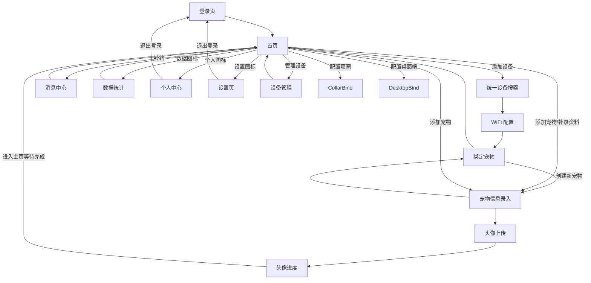

# 用户旅程文档：场景一 —— 新用户完整链路

## 全流程导航图

---

## 用户背景

用户是一位宠物主人，拥有一只宠物（猫/狗），同时购买了 YEHEY 宠物项圈和桌面摆台。用户首次打开小程序，需要完成登录、设备绑定、宠物信息录入、动态定制，最终进入主页面查看宠物状态。

---

## 第一阶段：登录与设备引导

### 步骤 1.1 — 登录页

**所在页面：** `pages/login/index`

**用户看到：**
- 顶部 "YEHEY" 品牌文字
- 中间圆形区域内的宠物 logo 图片（猫+狗卡通形象）
- "欢迎来到宠物新世界" 标题
- 两个登录按钮：
  - "本机号码快捷登录"（灰色，生产环境）或 手机号输入框 + "开发登录" 按钮（开发环境）
  - "微信账号登录"（白色按钮）
- 两条协议勾选项（默认已勾选）：
  - ☑ 我同意《YEHEY平台个人及宠物信息收集声明》中所述与第三方共享信息
  - ☑ 我已阅读关于七七七八八八九九九六六的《xxxxxx细则》
- 底部 "还没有账号？立即注册" 链接

**下一步操作：**
- 点击「微信账号登录」或「本机号码快捷登录」按钮。登录成功后直接进入首页。

---

### 步骤 1.2 — 统一设备搜索

**所在页面：** `pages/collar-bind/index`

**用户看到：**
- 左上角返回箭头
- 顶部 "YEHEY" + 宠物形象轮廓图
- "配置宠物项圈" 标题
- 设备连接示意图：宠物图标 ⟷ 链接图标 ⟷ 项圈图标
- **Step 1：** "使用磁吸充电电线给项圈充电以启动设备"（灰色面板 + 充电符号 ⌁）
- **Step 2：**
  - 生产环境："确保手机蓝牙开启，扫描设备二维码完成绑定"（扫码面板，显示 "ID:--"，提示 "点击扫码绑定"）
  - 开发环境：MAC 地址输入框（placeholder "请输入设备 MAC 地址"）+ "绑定设备" 按钮 + "ID:--"
- 底部进度条（约 26% 位置）

**下一步操作：**
- 生产环境：点击扫码面板 → 打开相机扫描项圈上的二维码
- 开发环境：输入 MAC 地址（如 "AABBCCDDEEFF"）→ 点击「绑定设备」
- 绑定成功后：
  - 设备 ID 显示为真实 MAC 地址
  - 按钮文案变为「进入 WiFi 配置」
  - 点击按钮进入 WiFi 配置页

---

### 步骤 1.3 — WiFi 配置

**所在页面：** `pages/wifi-config/index`

**用户看到：**
- 顶部 "YEHEY" + 宠物形象
- "配置宠物项圈" 标题
- 设备连接示意图
- **Step 3：** "选择宠物佩戴日常活动范围内的网络，以保持信号连接"
- 三个灰色占位框（模拟附近网络列表）
- WiFi 连接卡片：
  - WiFi 名称（自动获取当前 WiFi 或手动输入框）
  - 密码输入框（placeholder "请输入Wi-Fi密码"）
  - 提示 "输入密码后点击此区域继续"
- 底部进度条（约 52% 位置）

**下一步操作：**
- 输入 WiFi 密码 → 点击整个卡片区域提交配置
- 配置成功后直接进入绑定宠物页

---

> **关于桌面端绑定的提示：** 当前桌面端与项圈共用同一条设备搜索链路，按设备名称识别类型。用户可在首页或设备管理页随时添加。

---

## 第二阶段：信息录入与动态定制

### 步骤 2.1 — 绑定宠物 / 宠物信息录入

**所在页面：** `pages/pet-info/index`

**用户看到：**
- 左上角返回箭头
- 顶部 "YEHEY" + 宠物形象
- "录入宠物信息" 标题
- 宠物类型选择：「猫咪」/「狗狗」切换按钮（默认选中猫咪）
- 表单字段：
  - 宠物名字（必填，placeholder "请输入名字"）
  - 宠物品种（必填，placeholder "请输入品种"）
  - 性别选择：「公」/「母」切换按钮
  - 出生日期（可选，placeholder "请输入出生日期"）
  - 体重（可选，placeholder "请输入体重"）
- "保存，下一步" 按钮（名字填写后激活）

**下一步操作：**
- 若从绑定页进入：保存后回到绑定宠物页，默认选中新宠物，用户点击确认后完成设备绑定
- 若从首页进入：保存后跳转到头像上传页

---

### 步骤 2.2 — 宠物动态定制（上传照片）

**所在页面：** `pages/pet-avatar/index`

**用户看到：**
- 顶部 "YEHEY"
- "定制宠物动态" 标题
- 宠物摘要信息：宠物图标 + "毛毛 英短蓝猫"
- "图像上传示例：" 标题 + 4 张示例照片网格（标注：正面坐姿、侧面站立、抬头特写、全身照）
- 上传区域：
  - 未上传时：上传图标 + "点击上传照片"
  - 已上传时：照片预览
- 定制额度显示："当前定制额度（2/2）"
- "开始定制宠物动态图像" 按钮（上传照片后激活）
- "跳过，稍后再完成" 链接
- 底部进度条（约 52% 位置）

**下一步操作：**
- 点击上传区域 → 从相册选择宠物照片 → 照片预览显示在上传区域
- 点击「开始定制宠物动态图像」→ 系统上传照片并创建定制任务，跳转到进度页

---

### 步骤 2.3 — 动态定制进度

**所在页面：** `pages/avatar-progress/index`

**用户看到：**
- 顶部 "YEHEY"
- "正在定制专属动态" 标题
- 圆形进度环（绿色渐进）：
  - 排队中：28%，文案 "已收到照片，正在排队处理中"
  - 处理中：72%，文案 "正在生成宠物动态图像"
  - 完成：100%，文案 "左右滑动查看行为动态"
  - 失败：72%（红色），文案 "定制失败请重新上传图像"
- 预览卡片（完成后）：左右箭头 + 动态图像预览 + 行为标签
- 宠物信息摘要
- 底部操作按钮：
  - "立即配置桌面端"
  - "直接进入主页"
  - "不满意？重新定制" 链接
- 底部进度条（约 78% 位置）

**下一步操作：**
- 等待定制完成（自动轮询，或收到 WebSocket 推送后刷新）
- 定制完成后可进入主页，后续仍可从首页继续添加设备

---

## 第三阶段：主页面与功能验证

### 步骤 3.1 — 首页

**所在页面：** `pages/index/index`

**用户看到：**
- **左侧栏：**
  - 活跃值指示点（黄色圆点）
  - 垂直活跃值条（高度随活跃值变化）
  - "活跃值" 标签
  - 铃铛图标（点击进入消息页）
- **右侧主内容：**
  - 顶部宠物卡片：宠物头像 + "毛毛" + "英短蓝猫"
  - 对话气泡："毛毛还没有最新行为"（无行为时）/ "毛毛最新行为：奔跑"（有行为时）
  - 宠物展示区：大图宠物形象（可左右滑动切换多只宠物）
  - "‹ ——— 左右滑动切换宠物 ——— ›" 提示
  - 设备卡片区（2列）：
    - 项圈：项圈图标 + "测试项圈" + "在线 · 80%"
    - 桌面端：水晶球图标 + "桌面端" + "点击此处配置桌面端"
  - "管理设备 >" 链接（有设备时显示）
- **底部 TabBar：** 个人中心图标 | 数据图标 | 设置图标

**下一步操作：**
- 点击铃铛 → 进入消息页（步骤 3.2）
- 点击底部数据图标 → 进入数据统计页（步骤 3.3）
- 点击底部个人中心图标 → 进入个人中心页（步骤 3.4）
- 点击底部设置图标 → 进入设置页（步骤 3.5）
- 点击 "管理设备" → 进入设备管理页（步骤 3.6）

---

### 步骤 3.2 — 消息中心

**所在页面：** `pages/messages/index`

**用户看到：**
- 顶部：返回箭头 + "消息中心" 标题 + "全部已读" 链接
- Tab 标签栏：「全部」|「授权通知」|「系统消息」
- 消息列表（每条消息）：
  - 左侧图标（根据类型：授权=人形、系统=铃铛）
  - 消息标题（加粗）
  - 消息内容摘要
  - 右上角时间
  - 右下角操作按钮 "查看详情" / "查看更新"
  - 未读消息左侧有蓝色竖线标记
- 无消息时显示 "暂无消息"

**下一步操作：**
- 切换 Tab 过滤消息类型
- 点击消息 → 弹出详情弹窗（标题 + 完整内容 + "我知道了" 按钮）
- 点击 "全部已读" → 所有消息标记为已读
- 点击返回 → 回到首页

---

### 步骤 3.3 — 数据统计

**所在页面：** `pages/data/index`

**用户看到：**
- 宠物切换器：左箭头 ‹ + 宠物侧面图 + 宠物正面图 + 宠物侧面图 + 右箭头 ›
- 模式 Tab：「日」|「周」（高亮）|「月」
- **周视图：**
  - "本周平均活跃度" + 百分比
  - 7 天柱状图（每天一根柱子，下方标注日期）
  - "行为类型" 标题 + 饼图（walking/running/sleeping 等类型占比）
- **日视图：**
  - 日期标题（如 "2026年3月28日"）
  - 活跃度环形图 + 主要行为提示
  - 6 个时间段柱状图
  - 活动类型统计表
- 底部按钮 "暂无异常 安心陪伴"

**下一步操作：**
- 切换日/周/月模式查看不同维度数据
- 左右切换宠物
- 返回首页

---

### 步骤 3.4 — 个人中心

**所在页面：** `pages/profile/index`

**用户看到：**
- "用户信息" 标题
- 用户信息卡片：
  - 头像 + 昵称（如 "开发用户"）
  - 手机号或配额信息
  - "开通会员" 按钮
- 账户信息区域：
  - "编辑资料" 按钮
  - 手机号：13800000001
  - 形象配额：2
- "我的服务" 区域：
  - 已授权宠物数量（如有）
  - 宠物卡片列表：头像 + 名字 + 品种 + 活跃值/最新行为 + "升级" 按钮
- "会员专属权益" 区域：
  - ☑ 升级宠物数量 ☑ 升级定制图像
  - ☑ 云端存储扩容 ☑ 优先客服支持
  - ☑ 专属主题皮肤
  - "查看详情" 按钮
- "退出登录" 按钮

**下一步操作：**
- 点击 "退出登录" → 清除登录状态，跳回登录页
- 返回首页

---

### 步骤 3.5 — 设置页

**所在页面：** `pages/settings/index`

**用户看到：**
- "设置" 标题
- "我的宠物" 卡片：2 张宠物缩略图
- 设置菜单列表（每项带右箭头 ›）：
  - 通知设置
  - 隐私设置
  - 主题设置
  - 语言选择
  - 关于我们
  - 帮助与反馈
  - 隐私政策
  - 退出登录
- "采集对照" 按钮（仅开发环境显示）

**下一步操作：**
- 点击任意设置项 → 显示 "Coming Soon" 提示
- 点击 "退出登录" → 清除登录状态，跳回登录页

---

### 步骤 3.6 — 设备管理

**所在页面：** `pages/devices/index`

**用户看到：**
- "我的设备" 标题
- 宠物标签页（水平滚动）：
  - 每个 Tab：宠物头像 + 名字 + 状态标签（"属于你的宠物" / "已授权"）
- 选中宠物的设备详情：
  - **项圈卡片：**
    - 项圈图标 + 名称 + 编辑图标 ✎
    - ● 在线 电量 80% 信号 4
    - 关联宠物：毛毛 英短蓝猫 | MAC地址：AABBCCDDEEFF
    - 「分享授权」和「解除当前绑定」按钮
  - **桌面端列表标题：** "毛毛&项圈关联的桌面端 (N)"
  - **桌面端卡片（每个）：**
    - 水晶球图标 + 名称 + 绑定方式标签
    - 状态 + MAC地址
    - 操作按钮
  - 「+ 添加新设备」按钮

**下一步操作：**
- 切换宠物 Tab 查看不同宠物的设备
- 点击 "添加新设备" → 弹出选择菜单：添加项圈 / 添加桌面端
- 返回首页
