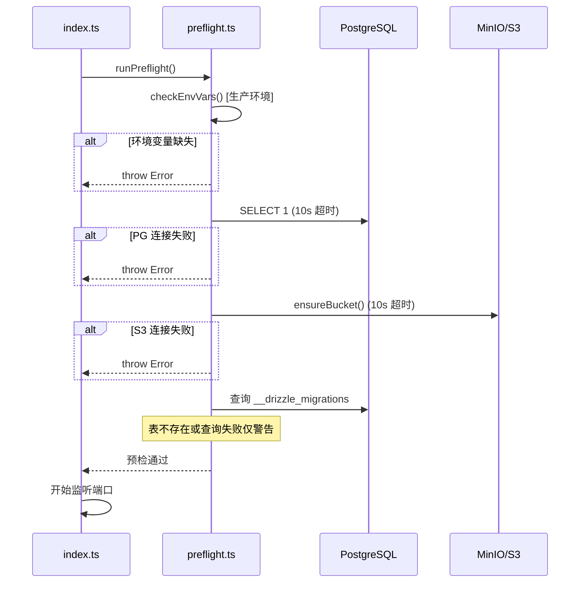

# 技术设计：服务器启动预检

## 架构概览

新增一个 `preflight` 模块，在服务器监听端口前执行所有依赖检查。采用"fail-fast"策略：遇到阻断性错误抛出异常，由入口决定是否退出。



## 需要修改/新增的文件

| 文件 | 操作 | 说明 |
|------|------|------|
| `packages/server/src/preflight.ts` | **新增** | 预检模块，包含所有检查逻辑 |
| `packages/server/src/index.ts` | **修改** | 在监听端口前调用 `runPreflight()`，catch 后退出 |
| `packages/server/src/utils/storage.ts` | **修改** | 导出 `ensureBucket` 和 `BUCKET` 供预检模块使用 |

## 详细设计

### 1. `packages/server/src/preflight.ts`

新增文件，核心函数：

```typescript
export async function runPreflight(): Promise<void>
```

检查失败时 **抛出异常**（不直接 `process.exit`），由 `index.ts` 的 catch 块决定退出行为。这样保持预检模块可测试、可复用。

**检查顺序与逻辑：**

#### 1.1 环境变量检查（仅 `NODE_ENV=production`）

检查以下环境变量是否已设置（非空）：
- `DATABASE_URL`
- `JWT_SECRET`
- `ADMIN_KEY`
- `WX_APPID`
- `WX_SECRET`
- `S3_ENDPOINT`
- `S3_ACCESS_KEY`
- `S3_SECRET_KEY`

缺失任一则收集完整缺失列表后抛出异常。

#### 1.2 PostgreSQL 连通性检查

使用已有的 `db` 实例执行 `sql\`SELECT 1\``，**设置 10 秒超时**（通过 `Promise.race` + `AbortController` 或简单的 setTimeout reject）。

成功输出确认日志，失败/超时抛出异常。

#### 1.3 MinIO/S3 连通性 + Bucket 初始化

调用 `ensureBucket()`（已包含 HeadBucket + 自动创建逻辑），**设置 10 秒超时**。

成功输出确认日志（含 bucket 名），失败/超时抛出异常。

**对 `storage.ts` 的改动：** 将 `ensureBucket` 和 `BUCKET` 导出。`ensureBucket` 的单例缓存特性保证启动调用后，后续 `uploadFile` 不会重复执行。

#### 1.4 数据库迁移状态检查

查询 `__drizzle_migrations` 表获取已应用迁移数量。此检查仅为辅助信息：
- 表不存在 → 输出警告 `⚠️ 未检测到迁移记录，请运行 pnpm db:migrate`
- 表存在 → 输出已应用迁移数量
- 查询失败 → 仅输出警告，不阻断启动

### 2. `packages/server/src/index.ts` 改动

在 `export default` 之前添加预检调用：

```typescript
import { runPreflight } from "./preflight";

// ... createApp() 等不变 ...

try {
  await runPreflight();
} catch (error) {
  console.error("启动预检失败，服务退出");
  process.exit(1);
}

console.log(`Server running on http://localhost:${port}`);
export default { ... } satisfies Serve.Options;
```

Bun 支持顶层 await。预检失败由入口 catch 后执行 `process.exit(1)`，预检模块本身不耦合进程生命周期。

### 3. 日志格式

统一使用 emoji 前缀便于快速识别：
```
🔍 正在检查服务依赖...
✅ PostgreSQL 连接正常
✅ MinIO 连接正常，bucket "pet-uploads" 已就绪
ℹ️ 已应用 4 个数据库迁移
✅ 所有依赖检查通过
```

失败示例：
```
🔍 正在检查服务依赖...
❌ PostgreSQL 连接失败: connect ECONNREFUSED 127.0.0.1:5432
启动预检失败，服务退出
```

### 4. 超时机制

为避免网络黑洞/DNS 卡死导致启动无限等待，PG 和 S3 检查均设置 **10 秒超时**：

```typescript
function withTimeout<T>(promise: Promise<T>, ms: number, label: string): Promise<T> {
  return Promise.race([
    promise,
    new Promise<never>((_, reject) =>
      setTimeout(() => reject(new Error(`${label} 检查超时 (${ms}ms)`)), ms)
    ),
  ]);
}
```

## 测试策略

- 手动验证：停止本地 PostgreSQL → 启动服务 → 确认报错退出
- 手动验证：停止本地 MinIO → 启动服务 → 确认报错退出
- 手动验证：设置 `NODE_ENV=production` 但不设 `WX_APPID` → 确认报错退出
- 正常启动：所有依赖就绪 → 确认输出所有 ✅ 日志后正常服务

## 安全考虑

- 错误日志中不泄露数据库密码或 S3 密钥，只输出连接错误信息
- 环境变量检查只检查"是否设置"，不输出具体值
