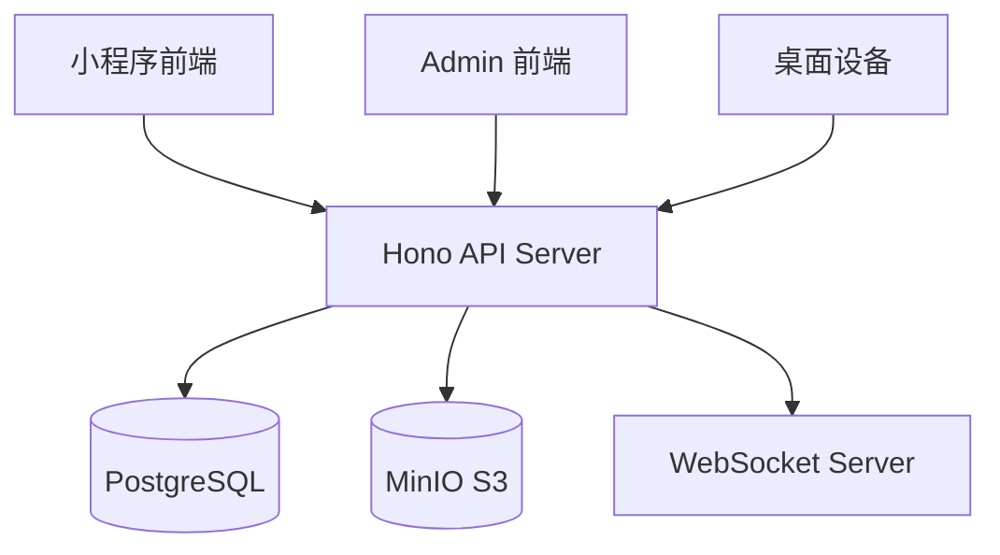

# 技术设计 — 后端 V2 功能迭代

## 架构概览

本次迭代在现有 Hono + Bun + Drizzle ORM 后端和 React + Ant Design admin 前端上扩展，遵循现有的模块化路由 + mock DB 测试模式。



## 技术栈

- **后端**: Hono + Bun + TypeScript（沿用）
- **ORM**: Drizzle ORM + drizzle-kit 迁移（沿用）
- **测试**: bun:test + mock DB 模式（沿用）
- **Admin 前端**: React 18 + Ant Design 5 + Vite（沿用）
- **密码哈希**: Bun 内置的 `Bun.password`（基于 argon2/bcrypt，无需额外依赖）
- **共享类型**: `@pet-wechat/shared`（沿用）

## 数据库变更

### 迁移策略（回应 review #4）

- PostgreSQL 16，`ALTER TYPE ... ADD VALUE` 不能在事务内执行
- drizzle-kit 生成的迁移默认不包裹事务，兼容枚举扩展
- **发布顺序**：先执行迁移 → 再部署新代码，避免写入未知枚举值
- 枚举扩展不可回滚，如需回退只能通过代码逻辑忽略新值
- 所有新增列使用 nullable 或有 default，保证迁移兼容存量数据

### 修改现有表

#### `users` 表
```sql
ALTER TABLE users ADD COLUMN password_hash TEXT;
ALTER TABLE users ADD COLUMN device_binding_quota INTEGER DEFAULT 3 NOT NULL;
```

#### `pets` 表
```sql
-- species 枚举需要先扩展（不能在事务内）
ALTER TYPE species ADD VALUE 'other';
ALTER TABLE pets ADD COLUMN description TEXT;
ALTER TABLE pets ADD COLUMN color TEXT;
```

#### `messages` 表
```sql
ALTER TYPE message_type ADD VALUE 'activity';
ALTER TYPE message_type ADD VALUE 'health';
ALTER TYPE message_type ADD VALUE 'device';
ALTER TYPE message_type ADD VALUE 'community';
```

### 新增表

#### `petModes` — 宠物活动模式
```typescript
{
  id: text (PK),
  petId: text (unique, FK → pets.id, ON DELETE CASCADE),
  mode: petActivityMode ("free" | "custom" | "real"),
  createdAt: timestamp,
  updatedAt: timestamp,
}
```

#### `petModeSchedules` — 活动模式时间表
```typescript
{
  id: text (PK),
  petId: text (FK → pets.id, ON DELETE CASCADE),
  source: scheduleSource ("system" | "custom"),
  startTime: text,    // "HH:MM" 格式，严格校验
  endTime: text,      // "HH:MM" 格式，严格校验
  actionType: text,   // 行为类型
  sortOrder: integer (default: 0),
  createdAt: timestamp,
}
```
- 复合索引：(petId, source)
- 用户只能操作 source="custom"，admin 只操作 source="system"
- **不允许跨天**（endTime 必须 > startTime）
- 单宠物单 source 最多 20 条

#### `customActions` — 自定义动作
```typescript
{
  id: text (PK),
  petId: text (FK → pets.id, ON DELETE CASCADE),
  userId: text (FK → users.id),
  name: text,
  description: text (nullable),
  videoUrl: text,
  status: customActionStatus ("pending" | "processing" | "done" | "failed"),
  resultImageUrl: text (nullable),
  createdAt: timestamp,
}
```

#### `deviceInteractions` — 设备互动记录
```typescript
{
  id: text (PK),
  desktopDeviceId: text (FK → desktopDevices.id),
  petId: text (FK → pets.id),
  interactionType: interactionType ("touch" | "shake" | "gesture"),
  count: integer (default: 1),
  timestamp: timestamp,
}
```
- 索引：(petId, timestamp) 用于统计查询

### 删除级联更新（回应 review #3）

现有删除流程（pets.ts DELETE、admin.ts DELETE）需要扩展清理新增表：
- 删除宠物时：级联删除 petModes、petModeSchedules、customActions、deviceInteractions
- 删除用户时：通过宠物级联间接清理
- 删除桌面设备时：级联删除 deviceInteractions

通过 Drizzle schema 的 `.references()` + `onDelete: 'cascade'` 在 DB 层保证。

### 存量数据处理（回应 review #2）

- **petModes**：`GET /api/pets/:id/mode` 如果没有记录，自动创建默认记录 mode="free" 并返回（lazy init 模式）
- **petModeSchedules**：存量宠物的 system 时间表为空，等 admin 配置；前端 localStorage 中的数据丢弃不迁移（用户手动重新配置 custom 时间表）

## API 设计

### 新增枚举（shared types）
```typescript
type PetActivityMode = "free" | "custom" | "real";
type ScheduleSource = "system" | "custom";
type CustomActionStatus = "pending" | "processing" | "done" | "failed";
type InteractionType = "touch" | "shake" | "gesture";
type MessageType = "system" | "authorization" | "activity" | "health" | "device" | "community";
type Species = "cat" | "dog" | "other";
```

### Shared Types 扩展策略（回应 review #9）

- `Pet` 新增字段均为 optional（`description?: string | null`），不破坏现有代码
- `User` 新增 `deviceBindingQuota` 为 optional
- **`passwordHash` 不进 shared types**，只在 server schema 定义
- 新增 `PetMode`、`PetModeSchedule`、`CustomAction`、`DeviceInteraction` 接口
- `WsMessage` 扩展新增 `WsCustomActionDoneMessage` 和 `WsInteractionNewMessage`

### 用户端 API

#### 认证扩展（回应 review #1）

**设计决策**：保留 `POST /api/auth/phone` 的验证码登录即自动建号语义不变。新增 `POST /api/auth/register` 仅用于"带密码注册"场景。

| 方法 | 路径 | 请求体 | 响应 | 说明 |
|------|------|--------|------|------|
| POST | `/api/auth/register` | `{ phone, code, password }` | `{ token, user }` | 新用户注册（手机号已存在则返回 409） |
| POST | `/api/auth/phone` | `{ phone, code }` 或 `{ phone, password }` | `{ token, user }` | 登录（验证码登录保持 upsert 语义，密码登录需已注册） |

逻辑判断：
- 有 `code` 字段 → 验证码登录（保持现有 upsert 行为）
- 有 `password` 字段 → 密码登录（查找已有用户，比对 passwordHash，不存在则 401）
- 两者都有/都没有 → 400

老用户补设密码：不做。老用户继续用验证码登录，不需要密码。

#### 宠物活动模式
| 方法 | 路径 | 请求体 | 响应 |
|------|------|--------|------|
| GET | `/api/pets/:id/mode` | — | `{ mode: PetActivityMode, schedules: Schedule[] }` |
| PUT | `/api/pets/:id/mode` | `{ mode: PetActivityMode }` | `{ mode: PetMode }` |
| GET | `/api/pets/:id/mode/schedules` | — | `{ schedules: Schedule[] }` |
| POST | `/api/pets/:id/mode/schedules` | `{ startTime, endTime, actionType }` | `{ schedule: Schedule }` |
| PUT | `/api/pets/:id/mode/schedules/:scheduleId` | `{ startTime?, endTime?, actionType? }` | `{ schedule: Schedule }` |
| DELETE | `/api/pets/:id/mode/schedules/:scheduleId` | — | `{ success: true }` |

GET mode 逻辑：根据当前 mode 返回对应 source 的时间表：
- mode=free → 返回 source=system 的时间表
- mode=custom → 返回 source=custom 的时间表
- mode=real → 返回空时间表（占位）

用户只能 CRUD source="custom" 的时间段，不能修改 system 的。

#### 自定义动作
| 方法 | 路径 | 请求体 | 响应 |
|------|------|--------|------|
| GET | `/api/pets/:id/custom-actions` | — | `{ customActions: CustomAction[] }` |
| POST | `/api/pets/:id/custom-actions` | `{ name, description?, videoUrl }` | `{ customAction: CustomAction }` |
| DELETE | `/api/pets/:id/custom-actions/:actionId` | — | `{ success: true }` |

**状态机约束**（回应 review #11）：
- 合法状态迁移：pending → processing → done/failed
- `done` 状态必须有 `resultImageUrl`
- 用户不能删除 `processing` 状态的动作
- 图片/视频共用同一 bucket，通过文件扩展名区分

#### 互动记录
| 方法 | 路径 | 请求体 | 响应 |
|------|------|--------|------|
| POST | `/api/interactions` | `{ desktopDeviceId, petId, interactionType, count? }` | `{ interaction: Interaction }` |
| GET | `/api/interactions/:petId/stats` | query: `range=day\|week\|month` | `{ totalCount, byType: { touch, shake, gesture }, trend: Array<{ date, count }> }` |

**后端校验**（回应 review #12）：
- 验证 desktopDeviceId 与 petId 之间存在有效绑定（unboundAt IS NULL）
- count 必须为正整数（1-1000）
- timestamp 不超前于当前时间 + 1小时

#### 额度计算口径（回应 review #12）
- `deviceBindingUsed` = 用户拥有的桌面设备数量（count desktopDevices where userId）
- `avatarUsed` = 用户所有宠物的 petAvatars 数量

#### 用户信息扩展
`GET /api/me` 响应新增：
```typescript
{
  user: User,
  quotas: {
    avatarQuota: number,
    avatarUsed: number,
    deviceBindingQuota: number,
    deviceBindingUsed: number,
  }
}
```

### Admin API

#### 活动模式管理
| 方法 | 路径 | 请求体 | 响应 |
|------|------|--------|------|
| PUT | `/api/admin/pets/:id/mode/schedules` | `{ schedules: Array<{ startTime, endTime, actionType }> }` | `{ schedules: Schedule[] }` |
| POST | `/api/admin/pets/batch-schedules` | `{ petIds: string[], schedules: Array<{ startTime, endTime, actionType }> }` | `{ updatedCount: number }` |

PUT 逻辑：**事务内**删除该宠物所有 source=system 的时间表，插入新的（整体替换），避免并发下出现空时间表。

批量操作限制：petIds 最多 50 个。

#### 自定义动作管理
| 方法 | 路径 | 请求体 | 响应 |
|------|------|--------|------|
| GET | `/api/admin/custom-actions` | query: `status?` | `{ customActions: CustomAction[] }` |
| PUT | `/api/admin/custom-actions/:id` | `{ resultImageUrl?, status }` | `{ customAction: CustomAction }` |

Admin 更新状态时后端校验状态机合法性。

#### 互动记录管理
| 方法 | 路径 | 请求体 | 响应 |
|------|------|--------|------|
| GET | `/api/admin/interactions` | query: `limit?` | `{ interactions: Interaction[] }` |
| POST | `/api/admin/interactions/auto` | `{ petId, desktopDeviceId, count?, intervalMinutes? }` | `{ interactions: Interaction[], count }` |

#### 消息管理（回应 review #5 — 补漏）
现有 admin.ts 已有消息创建能力，本次只需确保：
- `POST /api/admin/messages`（如果不存在则新增）接受扩展后的 messageType
- Admin 前端 Events 页面或独立消息管理页支持创建新类型消息

## 需要修改的文件清单

### 后端 (packages/server/)
| 文件 | 改动 |
|------|------|
| `src/db/schema.ts` | 扩展枚举 + 新增 4 张表 + 扩展 users/pets 字段 + 添加 FK references |
| `src/routes/auth.ts` | 新增 register 路由 + phone 路由支持密码登录 |
| `src/routes/pets.ts` | 创建/更新接受新字段 + 删除时清理新表 |
| `src/routes/pet-modes.ts` | **新增** — 活动模式 CRUD |
| `src/routes/custom-actions.ts` | **新增** — 自定义动作 CRUD |
| `src/routes/interactions.ts` | **新增** — 互动记录上报 + 统计 |
| `src/routes/upload.ts` | 扩展支持视频文件 |
| `src/routes/me.ts` | 扩展响应包含额度信息 |
| `src/routes/admin.ts` | 新增模式管理/自定义动作/互动记录/消息创建的 admin 路由 |
| `src/websocket.ts` | 新增 custom-action:done, interaction:new 广播 |
| `src/index.ts` | 挂载新路由 |

### 测试 (packages/server/src/__tests__/)
| 文件 | 改动 |
|------|------|
| `helpers.ts` | 新增 fakeMode, fakeSchedule, fakeCustomAction, fakeInteraction + createApp 挂载新路由 |
| `pets.test.ts` | 新字段测试 |
| `auth.test.ts` | 注册 + 密码登录测试 |
| `pet-modes.test.ts` | **新增** |
| `custom-actions.test.ts` | **新增** |
| `interactions.test.ts` | **新增** |
| `me.test.ts` | 额度信息测试 |
| `messages.test.ts` | 新类型测试 |
| `upload.test.ts` | 视频上传测试 |

### 共享类型 (packages/shared/)
| 文件 | 改动 |
|------|------|
| `src/types.ts` | 新增类型 + 扩展现有类型（新字段均 optional） |

### Admin 前端 (packages/admin/)
| 文件 | 改动 |
|------|------|
| `src/App.tsx` | 新增路由和侧边栏菜单项 |
| `src/pages/Pets.tsx` | 表单/表格增加 description, color, species "other" |
| `src/pages/Users.tsx` | 表单/表格增加 deviceBindingQuota |
| `src/pages/PetModes.tsx` | **新增** — 活动模式管理页 |
| `src/pages/CustomActions.tsx` | **新增** — 自定义动作管理页 |
| `src/pages/Interactions.tsx` | **新增** — 互动记录管理页 |
| `src/api/client.ts` | 新增 API 调用函数 |

### 数据库迁移
| 文件 | 改动 |
|------|------|
| `drizzle/0004_*.sql` | **新增** — 通过 drizzle-kit generate 自动生成 |

## 测试策略

- **单元测试**：每个新路由文件对应一个 test 文件，沿用现有 mock DB 模式
- **覆盖范围**：
  - 正常路径（CRUD 成功）
  - 错误路径（404 不存在、403 无权限、400 参数错误）
  - 边界条件（空时间表、重复注册、密码为空、时间格式错误、跨天时间等）
  - 权限隔离（用户只能操作自己的数据、source 隔离）
  - 状态机（自定义动作的合法/非法状态迁移）
- **现有测试**：不修改现有测试逻辑，只在需要的地方扩展 mock data
- **测试基座更新**（回应 review #7）：`helpers.ts` 的 `createApp()` 必须挂载所有新路由，包括 admin 路由

## 逻辑后端化原则

所有业务逻辑必须放在后端，前端/admin 前端只做数据展示和表单提交，不做业务判断。具体包括：

1. **模式切换校验**：切换到 real 模式时，后端检查是否绑定了项圈，不通过则返回 400 + 具体错误信息，前端直接展示
2. **时间表权限**：后端校验 source 字段，用户请求只能操作 custom，admin 请求只能操作 system，前端不做 source 过滤
3. **时间表校验**（回应 review #10）：
   - HH:MM 格式正则校验
   - 不允许跨天（endTime > startTime）
   - startTime !== endTime
   - 重叠检测（同 petId + source 的时间段不能交叉）
   - 单宠物单 source 最多 20 条
   - sortOrder 自动递增（取当前最大值 + 1）
   - admin 整体替换在事务内执行
4. **互动统计聚合**：所有日/周/月维度的统计聚合在后端 SQL 完成，前端只渲染结果
5. **额度计算**：已用绑定数、已用定制次数在后端查询计算，前端只展示
6. **注册校验**：手机号格式（11位数字）、密码长度（6-32位）、验证码校验全部在后端，前端只做基础 UX 校验（非空）
7. **自定义动作状态流转**：状态机逻辑在后端（pending→processing→done/failed），后端校验合法迁移
8. **互动上报校验**：验证设备与宠物绑定关系、count 正整数、timestamp 合理范围

## 安全考虑

1. **密码存储**：使用 `Bun.password.hash()` (argon2id)，不存明文
2. **密码验证**：使用 `Bun.password.verify()`
3. **passwordHash 不进 shared types**，API 响应不返回此字段
4. **权限隔离**：
   - 用户只能操作自己宠物的模式/自定义动作
   - 用户只能操作 source="custom" 的时间表
   - 互动上报 API 验证设备归属和绑定关系
5. **视频上传**：限制文件大小 50MB，校验 MIME type（video/mp4, video/quicktime）
6. **批量操作**：admin 批量接口限制单次最多 50 个宠物，防止滥用
