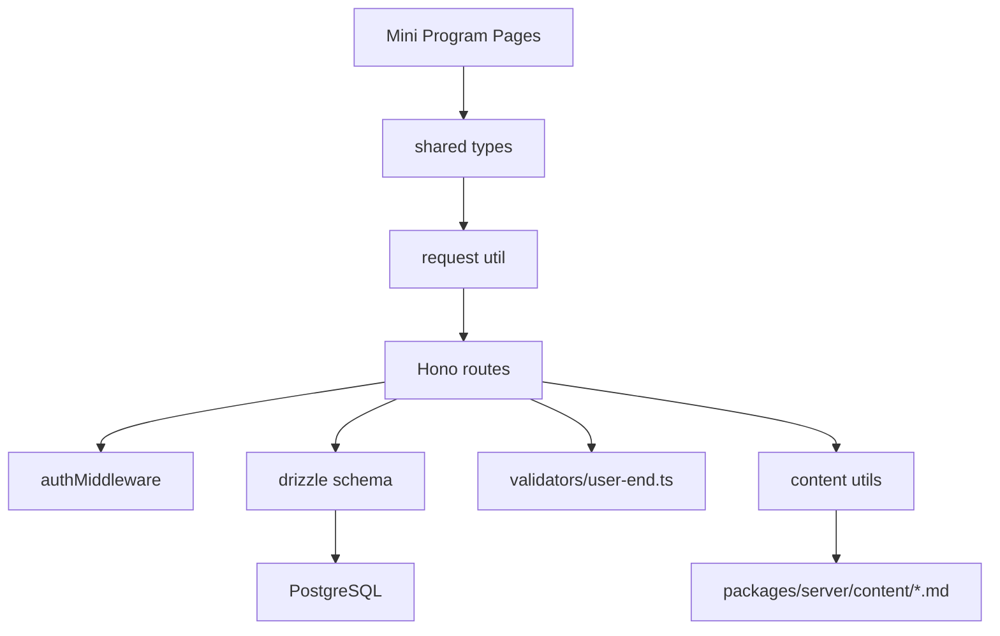

# 技术设计：用户端 API 补齐

## 架构概览

本次实现按「数据库 schema → 共享类型 → Hono 路由 → 小程序页面接入」四层落地，尽量复用现有鉴权和设备/宠物查询风格，不改登录体系。

### 服务端改动面

| 文件 | 角色 | 依赖 |
| --- | --- | --- |
| `packages/server/src/db/schema.ts` | 新增表、枚举、字段与外键定义 | `drizzle-orm/pg-core`、`createId` |
| `packages/server/src/routes/pets.ts` | 新增 `GET /api/pets/:petId/interaction-stats` | `db`、`interactionEvents`、`deviceAuthorizations` |
| `packages/server/src/routes/devices.ts` | 新增聚合设备列表、固件状态、固件升级、统一删除释放逻辑 | `collarDevices`、`desktopDevices`、`firmwareReleases`、`desktopPetBindings` |
| `packages/server/src/routes/me.ts` | `GET /api/me` 返回 `email`，`PUT /api/me` 禁止直改 `email` | `users`、zod 校验 |
| `packages/server/src/routes/settings.ts` | 新增 `GET/PUT /api/settings` | `userSettings` |
| `packages/server/src/routes/account.ts` | 新增手机/邮箱验证码发送与校验绑定接口 | `users`、zod 校验 |
| `packages/server/src/routes/content.ts` | 新增 Markdown 内容接口 | `packages/server/content/*.md`、`node:fs/promises`、`node:path` |
| `packages/server/src/index.ts` | 挂载 `settings/account/content` 路由 | `authMiddleware`、各 route |
| `packages/server/src/validators/user-end.ts` | 新增请求体/查询参数 zod schema | `zod` |
| `packages/server/src/utils/content.ts` | 读取 Markdown、拆 H1、计算版本与更新时间 | `fs/promises`、`path`、`Bun.spawnSync` |

### 中间件与风格复用

- 鉴权继续复用 [`packages/server/src/middleware/auth.ts`](/Users/yangliu35/code-space/pet-wechat/.claude/worktrees/steady-hatching-thompson/packages/server/src/middleware/auth.ts:1) 的 `authMiddleware`，所有新增接口默认挂在 `/api/*` 下。
- 响应格式继续沿用现状：成功返回 `c.json({ dataField })` 或 `c.json({ ...payload })`，失败返回 `c.json({ error }, statusCode)`，不引入统一 response wrapper。
- 宠物归属判断复用现有 owner + accepted authorization 双路径判断模式，避免在不同路由里出现不一致的 403/404 语义。
- 设备删除不再物理删除设备行，而是复用统一“释放设备” helper 更新 `claim_status/userId/petId`，保持设备可被再次认领。

### 建议的依赖关系



## Schema 变更

### 新增/补充枚举

| 枚举名 | 值 |
| --- | --- |
| `device_type` | `collar` / `desktop` |
| `device_claim_status` | `occupied` / `available` / `reset_required` |
| `device_upgrade_status` | `idle` / `pending` / `success` / `failed` |
| `user_setting_theme` | `system` / `light` / `dark` / `blue` |
| `user_setting_language` | `zh-CN` / `zh-TW` / `en-US` |

现有保留枚举也需要在 shared types 中同步完整列出：

- `species`: `cat` / `dog`
- `gender`: `male` / `female` / `unknown`
- `device_status`: `online` / `offline` / `pairing`
- `avatar_status`: `pending` / `processing` / `done` / `failed`
- `message_type`: `authorization` / `system`
- `binding_type`: `owner` / `authorized`
- `authorization_status`: `pending` / `accepted` / `rejected`

### `interaction_events`

建议定义：

| 字段 | 类型 | 约束 |
| --- | --- | --- |
| `id` | `text` | PK，默认 `createId` |
| `user_id` | `text` | not null，FK → `users.id` |
| `pet_id` | `text` | not null，FK → `pets.id` |
| `device_id` | `text` | nullable，本期不加 FK，原因是同一个字段可能指向项圈或桌面端 |
| `action_type` | `text` | not null |
| `occurred_at` | `timestamp with timezone` | not null，默认 `now()` |
| `created_at` | `timestamp with timezone` | not null，默认 `now()` |

索引：

- `idx_interaction_events_pet_occurred_at` on (`pet_id`, `occurred_at`)
- `idx_interaction_events_user_occurred_at` on (`user_id`, `occurred_at`)
- `idx_interaction_events_device_occurred_at` on (`device_id`, `occurred_at`)

说明：

- `R-01` 只读真实互动事件，不复用 `pet_behaviors`。
- `device_id` 暂不做 FK，避免和 `collar_devices` / `desktop_devices` 二选一冲突。

### `user_settings`

建议定义：

| 字段 | 类型 | 约束 |
| --- | --- | --- |
| `user_id` | `text` | PK，FK → `users.id` |
| `message_enabled` | `boolean` | not null，default `true` |
| `sound_enabled` | `boolean` | not null，default `true` |
| `theme` | `user_setting_theme` | not null，default `system` |
| `language` | `user_setting_language` | not null，default `zh-CN` |
| `updated_at` | `timestamp with timezone` | not null，default `now()` |

索引：

- 主键即唯一索引，无需额外二级索引

### `firmware_releases`

建议定义：

| 字段 | 类型 | 约束 |
| --- | --- | --- |
| `id` | `text` | PK，默认 `createId` |
| `device_type` | `device_type` | not null |
| `version` | `varchar(64)` | not null |
| `release_notes` | `text` | not null |
| `released_at` | `timestamp with timezone` | not null |

索引：

- `uq_firmware_releases_device_type_version` unique (`device_type`, `version`)
- `idx_firmware_releases_device_type_released_at` on (`device_type`, `released_at`)

外键：

- 无外键，发布记录按设备类型聚合，不绑定具体设备

### `users`

新增字段：

| 字段 | 类型 | 约束 |
| --- | --- | --- |
| `email` | `varchar(255)` | nullable，unique |

索引：

- `users_email_unique`

### `collar_devices` / `desktop_devices`

新增字段：

| 字段 | 类型 | 约束 |
| --- | --- | --- |
| `claim_status` | `device_claim_status` | not null，default `occupied` |
| `usage_duration_minutes` | `integer` | not null，default `0` |
| `upgrade_status` | `device_upgrade_status` | not null，default `idle` |

行为调整：

- 用户删除设备时，不物理删行，改为：
  - `user_id = null`
  - `pet_id = null`（仅项圈）
  - `claim_status = 'available'`
  - `upgrade_status = 'idle'`
  - `status = 'offline'`
  - `updated_at = now()`
- 桌面端同时把 `desktop_pet_bindings.unbound_at` 置为当前时间。

## API 合约

以下接口按 `requirements.md` 的 R-01..R-08 组织。

### R-01 宠物互动统计

#### `GET /api/pets/:petId/interaction-stats`

Query:

- `range?`: `day | week | month`

成功响应：

```json
{
  "totalCount": 12,
  "todayCount": 3,
  "weekCount": 8,
  "monthCount": 12,
  "buckets": [
    { "label": "00:00", "count": 0 }
  ]
}
```

约束：

- 无 `range` 时仅返回四个 count。
- `range=day` 返回 24 个小时桶。
- `range=week` 返回 7 个天桶。
- `range=month` 返回 30 个天桶。
- 聚合时间基准按服务器本地时区。

错误：

- `400`: `range` 非法
- `403`: 宠物存在，但当前用户既不是 owner 也没有 accepted authorization
- `404`: `petId` 不存在

实现位置：

- 扩展 `packages/server/src/routes/pets.ts`

### R-02 用户信息邮箱

#### `GET /api/me`

成功响应：

```json
{
  "user": {
    "id": "user-1",
    "phone": "13800138000",
    "email": "user@example.com",
    "nickname": "Mimi",
    "avatarUrl": null
  }
}
```

#### `PUT /api/me`

请求体：

```json
{
  "nickname": "新昵称",
  "avatarUrl": "https://example.com/avatar.png"
}
```

成功响应：

```json
{
  "user": {
    "id": "user-1",
    "nickname": "新昵称",
    "avatarUrl": "https://example.com/avatar.png",
    "email": "user@example.com"
  }
}
```

错误：

- `400`: body 非 JSON、字段类型非法、传入 `email`
- `404`: 当前用户不存在

### R-03 账号级设置

#### `GET /api/settings`

成功响应：

```json
{
  "settings": {
    "messageEnabled": true,
    "soundEnabled": true,
    "theme": "system",
    "language": "zh-CN"
  }
}
```

当用户无记录时直接返回默认值，不自动建行。

#### `PUT /api/settings`

请求体支持部分字段：

```json
{
  "soundEnabled": false,
  "theme": "dark"
}
```

成功响应：

```json
{
  "settings": {
    "messageEnabled": true,
    "soundEnabled": false,
    "theme": "dark",
    "language": "zh-CN"
  }
}
```

错误：

- `400`: body 非法、theme/language 不在枚举内

### R-04 固件状态/升级

#### `GET /api/devices/firmware/status`

成功响应：

```json
{
  "devices": [
    {
      "deviceId": "collar-1",
      "deviceType": "collar",
      "currentVersion": "1.0.0",
      "latestVersion": "1.1.0",
      "hasUpdate": true,
      "releaseNotes": "- 修复连接稳定性\n- 优化耗电",
      "upgradeStatus": "idle"
    }
  ]
}
```

规则：

- 仅返回当前用户拥有的设备。
- `latestVersion` / `releaseNotes` 取对应 `deviceType` 最新 `released_at` 的记录。
- 没有发布记录时，`latestVersion` 退化为 `currentVersion`，`hasUpdate=false`。

#### `POST /api/devices/:deviceType/:deviceId/firmware/upgrade`

请求体：空

成功响应：

```json
{
  "accepted": true,
  "upgradeStatus": "pending"
}
```

错误：

- `400`: `deviceType` 非 `collar|desktop`
- `404`: 设备不存在或不属于当前用户

### R-05 设备增强字段

#### `GET /api/devices`

成功响应：

```json
{
  "devices": [
    {
      "deviceId": "collar-1",
      "deviceType": "collar",
      "name": "Mimi 的项圈",
      "status": "offline",
      "firmwareVersion": "1.0.0",
      "claimStatus": "occupied",
      "upgradeStatus": "idle",
      "usageDurationMinutes": 120,
      "lastOnlineAt": "2026-04-10T10:00:00.000Z",
      "inactiveDays": 4,
      "isInactive": false,
      "petId": "pet-1",
      "bindings": []
    }
  ]
}
```

规则：

- 聚合项圈和桌面端为统一数组。
- `inactiveDays = floor((now - lastOnlineAt) / 1 day)`；`lastOnlineAt = null` 时视为 `null`。
- `isInactive = inactiveDays > 30`。

#### `DELETE /api/devices/:type/:id`

成功响应：

```json
{
  "success": true
}
```

规则：

- `type` 仅支持 `collar|desktop`
- 删除实际是释放设备所有权并更新 `claim_status='available'`
- 保留兼容旧前端的 `/api/devices/collars/:id`、`/api/devices/desktops/:id`，内部委托同一 helper

错误：

- `400`: `type` 非法
- `404`: 设备不存在或不属于当前用户

### R-06 内容页

#### `GET /api/content/:slug`

支持：

- `help`
- `about`
- `privacy`
- `user-agreement`

成功响应：

```json
{
  "content": {
    "slug": "help",
    "title": "帮助中心",
    "body": "## 常见问题\n\n...",
    "version": "2026-04-14T10:00:00.000Z",
    "updatedAt": "2026-04-14T10:00:00.000Z"
  }
}
```

规则：

- Markdown 第一行 H1 作为 `title`
- 返回 `body` 为去掉 H1 后的原始 Markdown
- `version` 优先取 `git log -1 --format=%cI -- <file>`，失败时回退文件 `mtime`

错误：

- `404`: slug 不在允许集合内，或对应文件不存在

### R-07 账号绑定

#### `POST /api/account/bind-phone/send-code`

请求体：

```json
{ "phone": "13800138000" }
```

成功响应：

```json
{
  "accepted": true,
  "mockCode": "000000"
}
```

说明：

- 复用现有短信登录的手机号格式校验
- 仅 mock，不实际发短信

#### `POST /api/account/bind-phone/verify`

请求体：

```json
{ "phone": "13800138000", "code": "000000" }
```

成功响应：

```json
{
  "user": {
    "id": "user-1",
    "phone": "13800138000",
    "email": null
  }
}
```

#### `POST /api/account/bind-email/send-code`

请求体：

```json
{ "email": "user@example.com" }
```

成功响应：

```json
{
  "accepted": true,
  "mockCode": "000000"
}
```

说明：

- 固定返回 mock code
- 代码中加 `TODO: 接入邮件服务`

#### `POST /api/account/bind-email/verify`

请求体：

```json
{ "email": "user@example.com", "code": "000000" }
```

成功响应：

```json
{
  "user": {
    "id": "user-1",
    "phone": "13800138000",
    "email": "user@example.com"
  }
}
```

错误：

- `400`: 手机号/邮箱格式非法、验证码错误、重复绑定当前值
- `404`: 当前用户不存在
- `409`: 手机号或邮箱已被其他账号占用，或当前账号已存在不同绑定值

### R-08 Migration 落地

需要提交：

- `packages/server/drizzle/0004_user_end_apis.sql` 或 drizzle 自动生成的等价文件
- `packages/server/drizzle/meta/*snapshot*.json`
- `packages/server/drizzle/meta/_journal.json`

## 共享类型

`packages/shared/src/types.ts` 需要新增或修改的类型建议如下：

### 需要修改

- `User`
  - 新增 `email: string | null`
- `CollarDevice`
  - 新增 `claimStatus`
  - 新增 `usageDurationMinutes`
  - 新增 `upgradeStatus`
- `DesktopDevice`
  - 新增 `claimStatus`
  - 新增 `usageDurationMinutes`
  - 新增 `upgradeStatus`

### 需要新增

- `DeviceType = "collar" | "desktop"`
- `DeviceClaimStatus = "occupied" | "available" | "reset_required"`
- `DeviceUpgradeStatus = "idle" | "pending" | "success" | "failed"`
- `UserSettingTheme = "system" | "light" | "dark" | "blue"`
- `UserSettingLanguage = "zh-CN" | "zh-TW" | "en-US"`
- `UserSettings`
- `InteractionStatsBucket`
- `InteractionStats`
- `DeviceFirmwareStatus`
- `DeviceSummary`
- `ContentSlug`
- `ContentPage`
- `BindCodeSendResponse`

`packages/shared/src/index.ts` 无需结构调整，继续 `export * from "./types"` 即可。

## 前端接入点

### 现有页面与替换点

- [`packages/app/src/pages/data/index.tsx`](/Users/yangliu35/code-space/pet-wechat/.claude/worktrees/steady-hatching-thompson/packages/app/src/pages/data/index.tsx:42)
  - 行 42-124：本地用 `behaviors` 现算 bucket，需要改为消费 `/api/pets/:petId/interaction-stats`
  - 行 166-176：`/api/behaviors/:petId` 的拉取逻辑改为 stats API
  - 行 247-315：硬编码 `0`、`互动接口待接入`、`桌面端互动记录待接入` 全部替换
- [`packages/app/src/pages/profile/index.tsx`](/Users/yangliu35/code-space/pet-wechat/.claude/worktrees/steady-hatching-thompson/packages/app/src/pages/profile/index.tsx:24)
  - 行 24-35：保留 `/api/me` 请求，但类型需要带 `email`
  - 行 67-68：`displayEmail` 从硬编码 `"未设置"` 改为 `user.email ?? "未设置"`
  - 行 108-112：账户信息区显示真实邮箱
- [`packages/app/src/pages/settings/index.tsx`](/Users/yangliu35/code-space/pet-wechat/.claude/worktrees/steady-hatching-thompson/packages/app/src/pages/settings/index.tsx:17)
  - 行 17-20：本地存储默认值改为“接口默认值 + 本地降级缓存”
  - 行 29-49：改为 `GET/PUT /api/settings` 同步
  - 行 52-59：`firmwareText` 改为基于 `/api/devices/firmware/status`
  - 行 117-133：两个 firmware card 去掉 toast stub，接入真实状态与升级入口
- [`packages/app/src/pages/settings/system.tsx`](/Users/yangliu35/code-space/pet-wechat/.claude/worktrees/steady-hatching-thompson/packages/app/src/pages/settings/system.tsx:11)
  - 行 11-13：语言默认值来自 `/api/settings`
  - 行 26-40：删除“修改密码”，保留绑定手机/邮箱并跳转绑定页
  - 行 45-54：语言写入改为接口，失败时回落本地缓存
- [`packages/app/src/pages/settings/theme.tsx`](/Users/yangliu35/code-space/pet-wechat/.claude/worktrees/steady-hatching-thompson/packages/app/src/pages/settings/theme.tsx:16)
  - 行 16-35：主题切换改为 `PUT /api/settings`
- [`packages/app/src/pages/devices/index.tsx`](/Users/yangliu35/code-space/pet-wechat/.claude/worktrees/steady-hatching-thompson/packages/app/src/pages/devices/index.tsx:51)
  - 行 51-58：`getUsageLabel(createdAt)` 改为真实 `usageDurationMinutes`
  - 行 79-90：设备读取切到 `/api/devices` + `/api/devices/firmware/status`
  - 行 231-249 / 284-294：删除操作改走 `DELETE /api/devices/:type/:id`
  - 行 377-418：补 `claimStatus`、`isInactive`、`upgradeStatus`、升级按钮态
- [`packages/app/src/pages/settings/help.tsx`](/Users/yangliu35/code-space/pet-wechat/.claude/worktrees/steady-hatching-thompson/packages/app/src/pages/settings/help.tsx:6)
  - 行 6-53：整页硬编码列表替换为 `/api/content/help` Markdown 渲染
- [`packages/app/src/pages/settings/about.tsx`](/Users/yangliu35/code-space/pet-wechat/.claude/worktrees/steady-hatching-thompson/packages/app/src/pages/settings/about.tsx:15)
  - 行 15-29：关于页正文改为 `/api/content/about`；协议/隐私跳转到新内容页
- [`packages/app/src/app.config.ts`](/Users/yangliu35/code-space/pet-wechat/.claude/worktrees/steady-hatching-thompson/packages/app/src/app.config.ts:10)
  - 行 22：`pages/settings` 子包需要新增 `privacy`、`user-agreement`，并建议新增 `bind-phone`、`bind-email`

### 需要新增的前端文件

- `packages/app/src/pages/settings/privacy.tsx`
- `packages/app/src/pages/settings/user-agreement.tsx`
- `packages/app/src/pages/settings/bind-phone.tsx`
- `packages/app/src/pages/settings/bind-email.tsx`
- `packages/app/src/utils/markdown.ts` 或等价 renderer 封装

## Markdown 内容文件

`packages/server/content/` 需要新增 4 个初始文件，内容可简短但必须是合法 Markdown。

### `help.md`

```md
# 帮助中心

## 常见问题

- 设备连接失败时，请先确认蓝牙与网络已开启。
- 固件升级显示等待中，表示请求已提交，稍后会自动刷新状态。

## 联系我们

如需人工协助，请通过 YEHEY 官方客服渠道联系。
```

### `about.md`

```md
# 关于 YEHEY

YEHEY 致力于通过智能硬件与小程序服务，帮助用户更稳定地了解宠物互动与陪伴状态。

## 产品说明

- 支持宠物设备绑定
- 支持互动记录与内容展示
```

### `privacy.md`

```md
# 隐私政策

我们会在提供设备绑定、账号识别和消息通知服务时处理必要的账号与设备数据。

## 数据使用

- 仅用于功能提供与服务改进
- 未经授权不会用于无关目的
```

### `user-agreement.md`

```md
# 用户协议

欢迎使用 YEHEY 宠物服务。继续使用即表示你同意在合法合规范围内遵守本协议。

## 使用规范

- 请勿冒用他人身份绑定设备
- 请妥善保管账号及设备信息
```

## Zod 校验

本次首次引入 zod，建议只用于新增/改造接口，不回头批量改旧路由。

### 放置位置

- 新建 `packages/server/src/validators/user-end.ts`

### 使用模式

每个 route 只做三件事：

1. `await c.req.json().catch(() => null)` 读取原始 body
2. `schema.safeParse(raw)` 做校验
3. 失败返回 `c.json({ error: "..." }, 400)`，成功后使用 `parsed.data`

建议 schema：

- `updateMeSchema`
- `updateSettingsSchema`
- `bindPhoneSendCodeSchema`
- `bindPhoneVerifySchema`
- `bindEmailSendCodeSchema`
- `bindEmailVerifySchema`
- `firmwareUpgradeParamsSchema`
- `interactionStatsQuerySchema`

示例模式：

```ts
const raw = await c.req.json().catch(() => null);
const parsed = updateSettingsSchema.safeParse(raw);

if (!parsed.success) {
  return c.json({ error: "Invalid request body" }, 400);
}
```

## 边界与错误处理

### 403 归属校验

- `/api/pets/:petId/interaction-stats`
  - 先查 `pets.id = petId`
  - 不存在：`404`
  - 存在但 `pets.userId !== userId` 且不存在 `device_authorizations(to_user_id=userId, pet_id=petId, status='accepted')`：`403`

### 404 slug 不存在

- `/api/content/:slug`
  - `slug` 不在 `help/about/privacy/user-agreement`：`404`
  - `slug` 合法但文件缺失：`404`

### 400 参数非法

- `range` 非 `day/week/month`
- `deviceType` 非 `collar/desktop`
- `theme` / `language` 不在枚举内
- `bind-phone` 手机号格式非法
- `bind-email` 邮箱格式非法
- `verify` 验证码不是 `000000`
- `PUT /api/me` 请求体包含 `email`

### 409 冲突

- 绑定手机号/邮箱时命中唯一索引
- 当前账号已经绑定了不同的手机号或邮箱，不允许通过 bind 接口直接替换

### 设备删除释放

- 删除成功后设备不应再出现在当前用户 `GET /api/devices` 结果中
- 设备记录保留，以便后续重新认领

### 内容解析失败

- Markdown 没有 H1 时，后端回退使用 slug 对应中文标题
- 文件读取异常统一返回 `404` 或 `500`，不把底层文件路径暴露给前端
